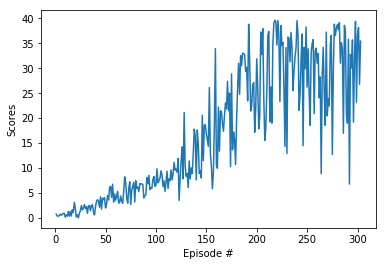

# Udacity Project 2 - Continuous Control

## Objective

To train a [Actor Critic Policy Gradient Network](https://deepmind.com/research/publications/sample-efficient-actor-critic-experience-replay/) agent for the Robotic Hand movement in UnityML agents

You can view the publication from DeepMind [here](https://arxiv.org/pdf/1611.01224.pdf)

## Background

In this environment, a double-jointed arm can move to target locations. 

**Reward**: A reward of +0.1 is provided for each step that the agent's hand is in the goal location. 

**Goal**: The goal of your agent is to maintain its position at the target location for as many time steps as possible.

**Observation Space**: The observation space consists of 33 variables corresponding to position, rotation, velocity, and angular velocities of the arm. Each action is a vector with four numbers, corresponding to torque applicable to two joints. 

**Action Space**: Every entry in the action vector should be a number between -1 and 1.

In order to consider the environment has been solved, the agent must get an average score of +30 over 100 consecutive episodes.

## Getting Started

### Repository

Clone the repository - 
```bash
git clone https://github.com/abhisheksgumadi/continuous-control.git .
```

### Jupyter Notebook
Install jupyter notebook with the command
```
pip install jupyter
```
Then, open the Continuous_Control.ipynb notebook

```
jupyter notebook Continuous_Control.ipynb
```

### Unity Environment
Download the Robotic Hand environment for Unity for MacOSX at [here](https://s3-us-west-1.amazonaws.com/udacity-drlnd/P2/Reacher/one_agent/Reacher.app.zip)

## Code Overview
The code consists of the following modules
```
Continuous_Control.ipynb - the main notebook
agent.py - defines the Agent that is being trained
model.py - defines the PyTorch model for the Actor and the Critic network
checkpoint_actor.pth - is the final trained Actor network
checkpoint_critic.pth - is the final trained Critic network
```

Please follow the code in Navigation.ipynb to train the agent

## Results

The average reward collection over 100 episodes plotted in a graph below. It shows the reward on the Y axis for every episode on the X axis 



